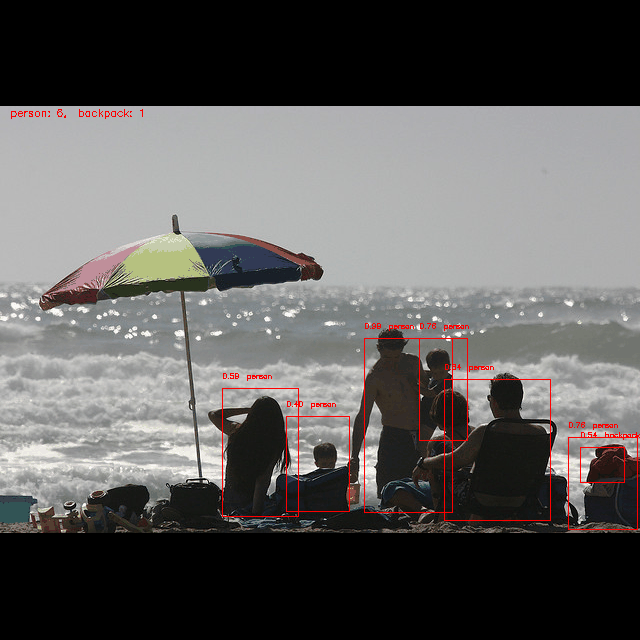

# Object detection model for the COCO2017 dataset

## Introduction

I am pleased to present my innovative object detection project, which uses the COCO2017 dataset. The model is adapted to recognize 80 different object classes and a maximum of 49 bounding boxes.

## Key Features

- Use of the YOLO algorithm.
- Application of transfer learning using ResNet101.
- Implementation of data augmentation on the COCO 2017 set.
- Use of metrics that allow for accurate evaluation of the model.

## Results
After 35 epochs of training, the model achieved the following results on the validation set:

1. ConfidenceAccuracy reached an impressive value of 92.46%, which means that the model correctly places bounding boxes where it should, and does not place them where it should not, in 92% of cases.
2. ClassRecoil was 67.62%, which means that the model correctly assigns classes to detected objects in 68% of cases.
3. AnchorRecoil was 72.29%, which shows that the model accurately selects anchors for object detection in 72% of cases.
4. *GlobalIOU was 0.4714, which means that the model correctly identifies object areas across the entire image in >47%.
5. *MeanIOU was 0.1907, which shows that the model’s bounding boxes overlap with actual objects on average by >19%.

_*IOU's values are calculated based on a cell in the pred-grid and a corresponding cell in the true-grid, so both IOU metrics actually show much better results._

## Visualization of results
Below I present a GIF animation that illustrates a comparison of the model’s predictions with actual annotations on the validation data set. Bounding boxes are marked with two colors: green for real bounding boxes and red for bounding boxes predicted by the model:

## License

This project is licensed under the [MIT License](LICENSE).
