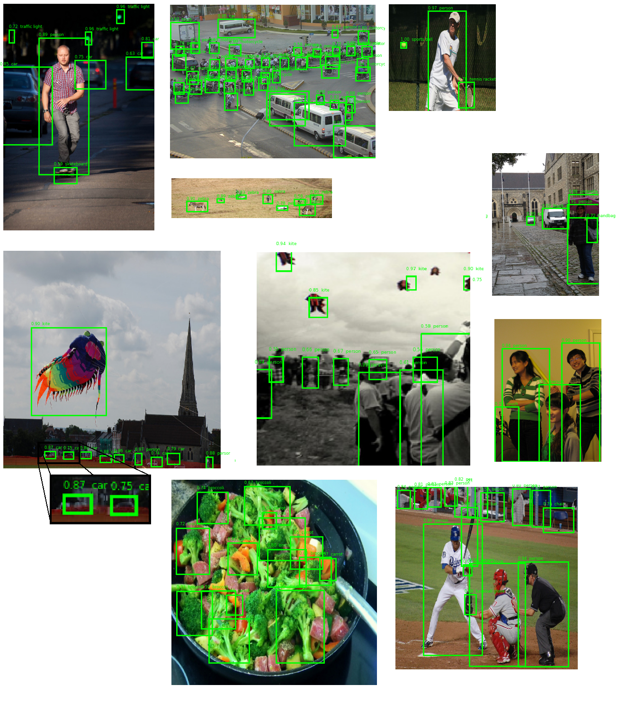

# Object detection model for the COCO2017 dataset

## Introduction

I am pleased to present my innovative object detection project, which uses the COCO2017 dataset. The model is adapted to recognize 80 different object classes and a maximum of 144 bounding boxes.

## Key Features

- Use of the YOLO algorithm.
- Application of transfer learning using EfficientNetV2B0.
- Implementation of data augmentation on the COCO 2017 set.
- Use of metrics that allow for accurate evaluation of the model.

## Results
The model achieved the following results on the validation set:

1. Mean Intersection over Union (IOU): The model achieved a mean IOU of 32%. This metric represents the average overlap between the predicted and  actual bounding boxes, indicating the model’s accuracy in object localization.
2. ConfidenceF1Score: The F1 score for confidence reached 55%. This score is a harmonic mean of precision and recall, providing a singular metric that balances both the false positives and false negatives in object detection.
3. Class Match Metric: The model scored 59% on the Class Match Metric. This metric measures the percentage of correctly classified objects among those detected, reflecting the model’s ability to correctly identify the classes of detected objects.
4. Anchor Match Metric: The model excelled in the Anchor Match Metric with a score of 92%. This metric evaluates how well the model matches anchors to ground truth boxes, which is crucial for generating accurate bounding box predictions.

## Visualization of results
Below is an image that illustrates the model predictions of the validation dataset from the COCO2017 set.

## License

This project is licensed under the [MIT License](LICENSE).
