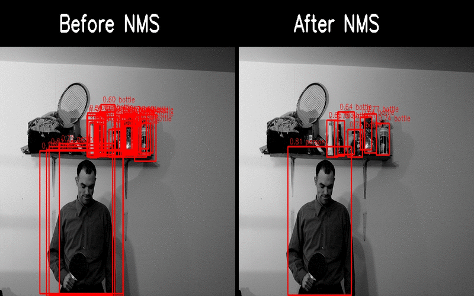

# Object detection model for the COCO2017 dataset

## Introduction

I am pleased to present my object detection project, which uses the COCO2017 dataset. The model has two output maps with different resolutions for objects of different sizes, which makes it anchor-free. To increase the efficiency of training, an algorithm was used that dynamically matches predicted bbox to true bbox during loss calculation based on IOU and classification using the Hungarian algorithm, and the Non-Maximum Suppression (NMS) algorithm to discard bbox that are very similar.

## Key Features

- Utilization of YOLOv8 architecture.
- Strong data augmentations using the Albumentations library.
- Dynamic matching algorithm used during loss calculation.
- Non-Maximum Suppression (NMS) algorithm used to discard similar bbox.

## Results
The model achieved the following results on the validation set:

1. Intersection over Union (IOU): The model achieved a mean IOU of 20%. This metric represents the average overlap between the predicted and actual bounding boxes, indicating the model’s accuracy in object localization.

2. F1-Score: The F1 score for confidence reached 36%. True Positive (TP) cases were recognized when the certainty of the bounding box and the classification matched, and the IOU was greater than 60%.

## Visualization of results
Below is an image that illustrates the model predictions of the validation dataset from the COCO2017 set.

## License

This project is licensed under the [MIT License](LICENSE).
